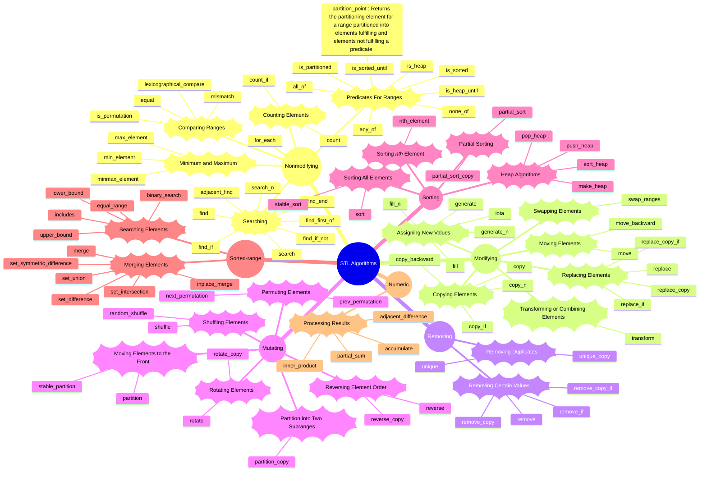

# STL Algorithms

## Mindmap

## Notes

### Predicates 

To increase their flexibility and power, several algorithms allow the user to pass user-defined operations, which they call internally. These operations might be ordinary functions, function objects or lambdas. If these functions return a Boolean value, they are called predicates.

### Suffixes

1. `_if`: used when you can call two forms of an algorithm that have the same number of parameters either by passing a value or by passing a function or function object. In this case, the version without the suffix is used for values, and the version with the _if suffix is used for functions and function objects.
2. `_copy`: used as an indication that elements are not only manipulated but also copied into a destination range.

### Sorting Criterion

The sorting criterion has to define a *strict weak ordering* on the values. A criterion, where values are compared as equal or less, such as operator <=, does not fit
this requirement.

### Algorithm Types

#### Nonmodifying

Operate with input and forward iterators; therefore, you can call them for all standard containers. 

    - for_each
    - Counting Elements
        - count
        - count_if
    - Minimum and Maximum
        - min_element
        - max_element
        - minmax_element
    - Searching
        - find : Searches for the first element with the passed value
        - find_if
        - find_if_not
        - find_end : Searches for the last occurrence of a subrange
        - find_first_of
        - adjacent_find : Searches for two adjacent elements that are equal (by some criterion)
        - search : Searches for the first occurrence of a subrange
        - search_n : Searches for the first n consecutive elements with certain properties
    - Comparing Ranges
        - equal : Returns whether two ranges are equal
        - is_permutation
        - mismatch
        - lexicographical_compare
    - Predicates For Ranges
        - is_sorted
        - is_sorted_until
        - is_partitioned
        - partition_point : Returns the partitioning element for a range partitioned into elements fulfilling and elements not fulfilling a predicate
        - is_heap
        - is_heap_until : Returns the first element in a range not sorted as a heap
        - all_of
        - any_of
        - none_of

#### Modifying

Such algorithms might modify the elements of a range directly or modify them while they are being copied into another range. If elements are copied into a destination range, the source range is not changed.

    - for_each : accepts an operation that modifies its argument. Thus, the argument has to be passed by reference.
    - Copying Elements
        - copy
        - copy_if
        - copy_n
        - copy_backward : Copies a range starting with the last element
    - Moving Elements
        - move
        - move_backward
    - Transforming or Combining Elements
        - transform : uses an operation that returns the modified argument. The trick is that it can be used to assign the result to the original element.
    - Swapping Elements
        - swap_ranges : Swaps elements of two ranges
    - Assigning New Values
        - fill
        - fill_n
        - generate : Replaces each element with the result of an operation
        - generate_n
        - iota : Replaces each element with a sequence of incremented values
    - Replacing Elements
        - replace
        - replace_if
        - replace_copy
        - replace_copy_if

#### Removing
    - Removing Certain Values
        - remove
        - remove_if
        - remove_copy : Copies elements that do not match a given value
        - remove_copy_if
    - Removing Duplicates
        - unique : Removes adjacent duplicates
        - unique_copy

#### Mutating
    - Reversing Element Order
        - reverse
        - reverse_copy
    - Rotating Elements
        - rotate
        - rotate_copy
    - Permuting Elements
        - next_permutation
        - prev_permutation
    - Shuffling Elements
        - shuffle
        - random_shuffle
    - Moving Elements to the Front
        - partition : Changes the order of the elements so that elements that match a criterion are at the front. Pass the exact sorting criterion that serves as the difference between the first and the second parts.
        - stable_partition : Same as partition() but preserves the relative order of matching and nonmatching elements
    - Partition into Two Subranges
        - partition_copy

#### Sorting
    - Sorting All Elements
        - sort : based historically on quicksort
        - stable_sort : based historically on mergesort. However, it needs enough additional memory to have n ∗ log(n) complexity. Otherwise, it has n ∗ log(n) ∗ log(n) complexity. The advantage of stable_sort() is that it preserves the order of equal elements.
    - Partial Sorting
        - partial_sort : based historically on heapsort. Thus, it guarantees n ∗ log(n) complexity in any case. However, in most circumstances, heapsort is slower than quicksort by a factor of two to five.  partial_sort() has the special ability to stop sorting when only the first n elements need to be sorted.
        - partial_sort_copy
    - Sorting *nth* Element
        - nth_element : stops when the nth element of the sequence is correct according to the sorting criterion. Pass the number of elements you want to have in the first part (and therefore also in the second part).
    - Heap Algorithms
        - make_heap
        - push_heap
        - pop_heap
        - sort_heap

#### Sorted-range
    - Searching Elements
        - binary_search
        - includes : Returns whether each element of a range is also an element of another range
        - lower_bound : Finds the first element greater than or equal to a given value
        - upper_bound : Finds the first element greater than a given value
        - equal_range : Returns the range of elements equal to a given value
    - Merging Elements
        - merge
        - set_union
        - set_intersection
        - set_difference
        - set_symmetric_difference
        - inplace_merge : Merges two consecutive sorted ranges

#### Numeric
    - Processing Results
        - accumulate
        - inner_product
        - partial_sum : Combines each element with *all* its predecessors
        - adjacent_difference : Combines each element with its predecessor