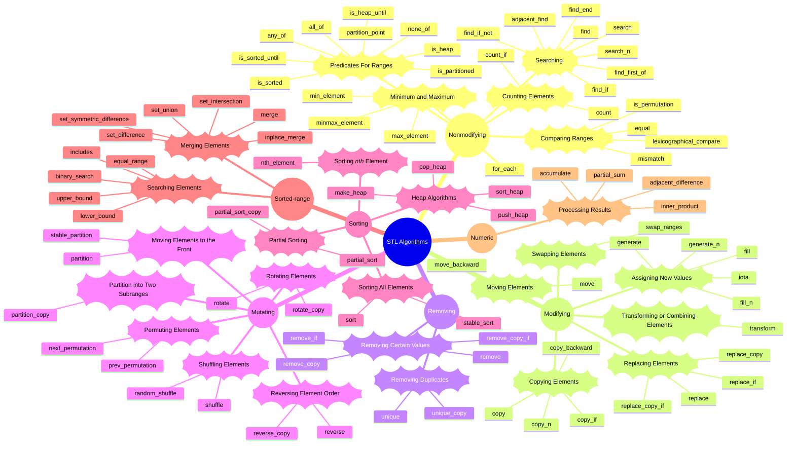

# STL Algorithms

## Mindmap

## Notes

### Predicates 

To increase their flexibility and power, several algorithms allow the user to pass user-defined operations, which they call internally. These operations might be ordinary functions, function objects or lambdas. If these functions return a Boolean value, they are called predicates.

### Suffixes

1. `_if`: used when you can call two forms of an algorithm that have the same number of parameters either by passing a value or by passing a function or function object. In this case, the version without the suffix is used for values, and the version with the _if suffix is used for functions and function objects.
2. `_copy`: used as an indication that elements are not only manipulated but also copied into a destination range.

### Algorithm Types

#### Nonmodifying

Operate with input and forward iterators; therefore, you can call them for all standard containers. 

    - for_each
    - Counting Elements
        - count
        - count_if
    - Minimum and Maximum
        - min_element
        - max_element
        - minmax_element
    - Searching
        - find
        - find_if
        - find_if_not
        - find_end
        - find_first_of
        - adjacent_find
        - search
        - search_n
    - Comparing Ranges
        - equal
        - is_permutation
        - mismatch
        - lexicographical_compare
    - Predicates For Ranges
        - is_sorted
        - is_sorted_until
        - is_partitioned
        - partition_point
        - is_heap
        - is_heap_until
        - all_of
        - any_of
        - none_of

#### Modifying

Such algorithms might modify the elements of a range directly or modify them while they are being copied into another range. If elements are copied into a destination range, the source range is not changed.

    - Copying Elements
        - copy
        - copy_if
        - copy_n
        - copy_backward
    - Moving Elements
        - move
        - move_backward
    - Transforming or Combining Elements
        - transform
    - Swapping Elements
        - swap_ranges
    - Assigning New Values
        - fill
        - fill_n
        - generate
        - generate_n
        - iota
    - Replacing Elements
        - replace
        - replace_if
        - replace_copy
        - replace_copy_if

#### Removing
    - Removing Certain Values
        - remove
        - remove_if
        - remove_copy
        - remove_copy_if
    - Removing Duplicates
        - unique
        - unique_copy

#### Mutating
    - Reversing Element Order
        - reverse
        - reverse_copy
    - Rotating Elements
        - rotate
        - rotate_copy
    - Permuting Elements
        - next_permutation
        - prev_permutation
    - Shuffling Elements
        - shuffle
        - random_shuffle
    - Moving Elements to the Front
        - partition
        - stable_partition
    - Partition into Two Subranges
        - partition_copy

#### Sorting
    - Sorting All Elements
        - sort
        - stable_sort
    - Partial Sorting
        - partial_sort
        - partial_sort_copy
    - Sorting *nth* Element
        - nth_element
    - Heap Algorithms
        - make_heap
        - push_heap
        - pop_heap
        - sort_heap

#### Sorted- range
    - Searching Elements
        - binary_search
        - includes
        - lower_bound
        - upper_bound
        - equal_range
    - Merging Elements
        - merge
        - set_union
        - set_intersection
        - set_difference
        - set_symmetric_difference
        - inplace_merge

#### Numeric
    - Processing Results
        - accumulate
        - inner_product
        - partial_sum
        - adjacent_difference